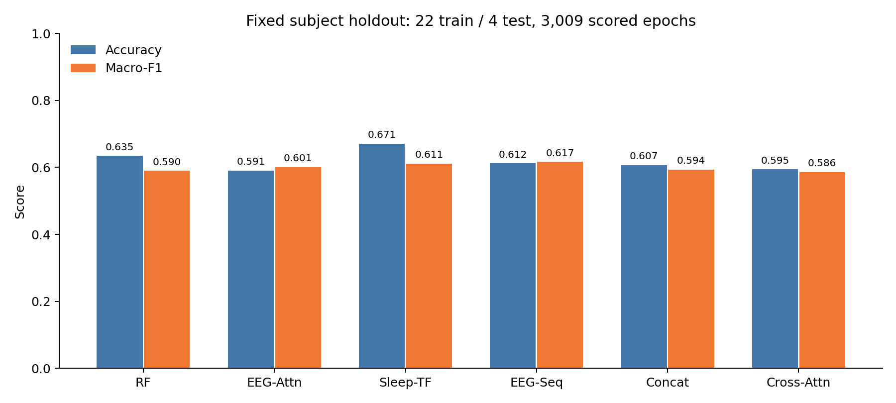

# EEG-HRV Sleep Staging

**基于 EEG 与 HRV 的五类睡眠分期研究：随机森林对照、多尺度 CNN、分层 Transformer 与多模态融合。**

输入脑电波形（EEG）和从心电（ECG）提取的心率变异性特征（HRV），输出每个 **30 秒**窗口属于 **Wake、N1、N2、N3、REM** 中哪一类。项目已完成真实数据上的 GPU 训练、受试者独立测试、模型保存和恢复预测。

## 当前成果：深度学习阶段

数据使用 [MIT-BIH Polysomnographic Database](https://physionet.org/content/slpdb/1.0.0/) 与 [ISRUC-Sleep Subgroup III](https://sleeptight.isr.uc.pt/?page_id=48)。共 **26 人、18,770 个有效窗口**，固定 **22 人训练 / 4 人测试，不设验证集**；训练 15,761 个窗口、测试 3,009 个窗口。同一人的所有记录始终属于同一组。

五种神经网络全部从头训练 **40 轮**，采用预先固定的参数与最后一轮权重。所有模型训练完毕后才统一读取测试成绩，没有按测试成绩选轮数或调整参数。

| 模型 | 输入 | 测试 Accuracy | Macro-F1 | N1 F1 | REM F1 |
|---|---|---:|---:|---:|---:|
| 随机森林对照 | 7 项 EEG + 26 项 HRV 特征 | 63.48% | 0.5896 | 0.5286 | 0.3846 |
| 多尺度 CNN + Attention | 单个 EEG 窗口 | 59.06% | 0.6008 | 0.4338 | 0.4220 |
| 分层频谱 Transformer | 连续 EEG 频谱 | **67.10%** | 0.6112 | **0.5699** | 0.3014 |
| CNN + 时序 Transformer | 连续 EEG 波形 | 61.22% | **0.6166** | 0.4375 | 0.4921 |
| EEG-HRV 拼接 Transformer | EEG 波形 + HRV | 60.68% | 0.5935 | 0.3405 | **0.5000** |
| EEG-HRV Cross-Attention Transformer | EEG 波形 + HRV | 59.45% | 0.5859 | 0.3847 | 0.4405 |



**本轮发现：**分层频谱 Transformer 的整体准确率比同一划分的随机森林高 3.62 个百分点；CNN + 时序 Transformer 的五类平均 F1 最高。多模态融合没有取得稳定的整体优势：Cross-Attention 在 ISRUC 测试部分为 70.32%，在 MIT-BIH 测试部分为 45.76%，需要继续研究数据库差异。这里只报告本轮预设实验，不据此宣称确定了最优模型。

这是 **4 位测试受试者、一个划分、一个训练随机种子**的探索性结果。CNN 注意力与分层频谱 Transformer 是参考 [AttnSleep](https://github.com/emadeldeen24/AttnSleep) / [SleepTransformer](https://github.com/pquochuy/SleepTransformer) 思路的独立轻量实现，不是原论文模型的完整复现。

## 已完成的处理与训练

1. 校验原始 EEG、ECG 与人工睡眠标签；ISRUC 使用 C4-A1 脑电、X2 心电和第一位专家标注。X2 的 EDF 通道说明明确标记为 `EKG_Channel`。
2. ISRUC 原始文件有 8,889 个窗口；依据[提供方说明](https://sleeptight.isr.uc.pt/?page_id=76)，实验去掉每条记录末尾 30 个噪声窗口，剩余 8,589 个。原始文件不修改。MIT 保留 10,181 个有效窗口。
3. EEG 每个窗口独立进行 0.3–35 Hz 滤波、统一为微伏并重采样至 100 Hz；每窗 3,000 个采样点，频谱为 29×89。
4. SleepECG 检测 ECG 心跳，提取 26 项时域 HRV 特征。HRV 最长覆盖过去 5 分钟，截止当前窗口末尾；融合网络额外输入 26 个缺失标记。
5. 连续模型使用当前及过去共 5 个连续窗口，不跨记录、不跨缺失标签间隔。填补与标准化统计只从训练集计算。
6. 使用加权交叉熵、AdamW、余弦学习率衰减和轻微训练增强。已通过受试者隔离、历史窗口边界、训练集预处理、左侧填充与梯度检查。
7. 保存全部权重、200 轮训练日志、每窗测试概率、各受试者/数据库指标及四张图。Cross-Attention 模型恢复后的 3,009 个预测与原测试预测完全一致。

## 查看结果

- [项目详细说明](PROJECT.md)
- [深度学习实验报告](results/deep_learning/report.md)
- [完整指标](results/deep_learning/metrics.json)、[逐受试者指标](results/deep_learning/per_subject.csv)、[逐数据库指标](results/deep_learning/per_dataset.csv)
- [混淆矩阵](results/deep_learning/confusion_matrices.png)、[训练曲线](results/deep_learning/training_curves.png)、[睡眠分期时间图](results/deep_learning/heldout_hypnograms.png)
- [固定实验参数](deep_learning/protocol.json)、[数据清单](results/deep_learning/data_audit.json)、[实际训练环境](results/deep_learning/environment.json)、[恢复验证](results/deep_learning/verification.json)

## 复现深度学习实验

建议 Python 3.11，GPU 可显著加快训练。已在现有 Conda `pytorch` 环境（PyTorch 2.6.0+cu118、RTX 4060 Laptop）完成训练。可复用已有环境；不要为了复现重复下载本机已有数据。

```powershell
conda activate pytorch
python -m pip install -r requirements-deep-learning.txt
```

原始数据不上传 GitHub。首次复现可用以下命令下载 MIT 与 ISRUC：

```powershell
python main.py prepare --data-dir data --cache cache/features.csv
python scripts/download_isruc_s3.py --destination data/isrucIII
python scripts/inspect_isruc_s3.py --destination data/isrucIII
```

MIT 下载约 632 MB；ISRUC III 下载约 1.35 GiB。ISRUC 下载程序使用作者公开分享链接，支持断点续传、MEGA 文件认证及 SHA-256 校验。若分享源不可用，可从作者页面下载到相同目录结构（`data/isrucIII/1/1.rec` 等）。

```powershell
python -m deep_learning.prepare --mit-dir data/slpdb --isruc-dir data/isrucIII
python -m deep_learning.checks
python -m deep_learning.train --results results/reproduction
python -m deep_learning.evaluate --results results/reproduction
python -m deep_learning.predict --results results/reproduction --kind fusion_cross --output results/reproduction/restored_predictions.csv
```

复现实验写入独立的 `results/reproduction`，保护仓库中的实际结果。训练与评估会阻止重复使用已经打分的结果目录来调参。完整复现实验需重新准备原始数据；预测程序目前接收本项目生成的对齐缓存，尚不是任意未标注文件的通用接口。

**版本说明：**本次数据准备使用 `requirements.txt` 的科学计算环境，训练/测试使用 `results/deep_learning/environment.json` 中的 Conda 环境；两者的 SciPy、pandas 等版本不同。上面的单环境命令用于方便运行，不承诺与原实验逐位相同。按原版本复现两阶段的步骤见 [运行说明](docs/REPRODUCE.md)。

## 历史基线

早期 MIT 单数据库的随机森林五折实验仍保留在 `main.py`、`results/` 顶层和 `artifacts/model_parts/`。EEG-HRV 融合 Accuracy 为 60.42%、Macro-F1 为 0.5299；这是不同数据与划分的历史结果，**不能拿来直接计算本轮深度学习的提升幅度**。详见 [历史基线说明](docs/BASELINE.md)。

## 目录

| 路径 | 内容 |
|---|---|
| `deep_learning/` | 数据准备、五种网络、训练、测试、恢复预测和边界检查 |
| `scripts/` | ISRUC III 下载与原始文件检查 |
| `results/deep_learning/` | 本轮六模型的权重、报告、指标、概率、日志与图表 |
| `docs/` | 复现步骤、历史基线说明 |
| `main.py`, `results/` 顶层 | 早期 MIT 随机森林基线 |
| `artifacts/model_parts/`, `rebuild_model.py` | 早期最终融合模型的分块与恢复工具 |

MIT 数据使用 [ODC Attribution 1.0](https://physionet.org/content/slpdb/1.0.0/)；ISRUC 数据的使用与引用请遵循作者页面要求。SleepECG 作为依赖调用，未复制其源码。模型参考作者代码的结构思想，研究中请引用相关论文及数据库。
