# Figures / 图表

All figures are generated from preserved data and scores. Each is available as PNG, SVG and PDF. / 所有图表由保存的数据和指标生成，提供 PNG、SVG、PDF。

Sources: `python -m experiments.v2.figures`. Score bars use three individual seeds; confusion matrices and timelines explicitly use equal-probability ensembles.

## Model architecture and ablation components / 模型结构与对照组件

[PNG](../results/v2/figures/architecture.png) · [SVG](../results/v2/figures/architecture.svg) · [PDF](../results/v2/figures/architecture.pdf)

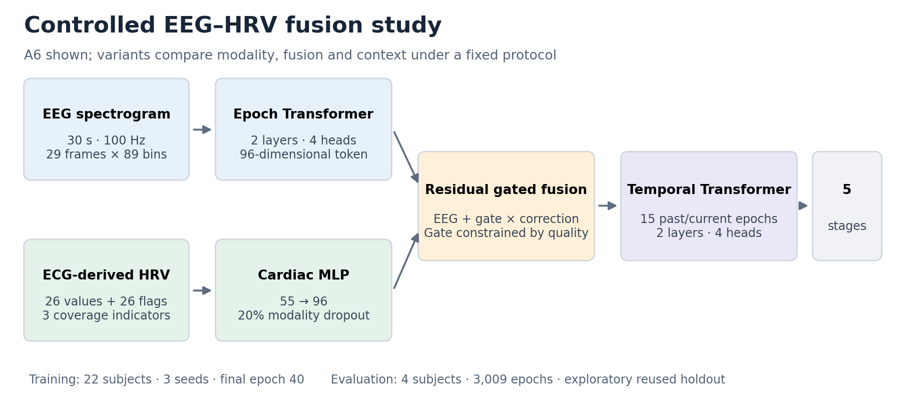

Overview of A6; detailed tensor shapes and A1 comparison are in the technical diagrams below. / A6 的模块概览；详细尺寸与 A1 对照见下方技术图。

## Subjects, retained epochs and stage distributions / 受试者、窗口数及类别分布

[PNG](../results/v2/figures/data_overview.png) · [SVG](../results/v2/figures/data_overview.svg) · [PDF](../results/v2/figures/data_overview.pdf)

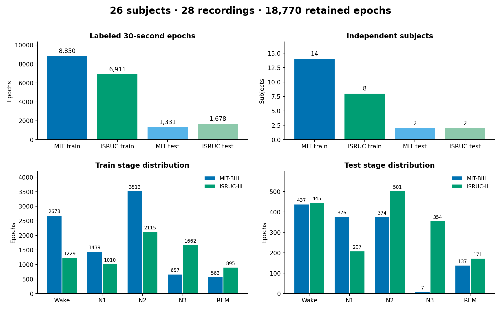

Read subject counts separately from epoch counts; windows from one person are correlated. / 区分人数与窗口数；同一人的相邻窗口不是独立受试者。

## Seven variants, three individual seeds; mean ± sample SD / 七组模型三个独立种子的均值与样本标准差

[PNG](../results/v2/figures/ablation_results.png) · [SVG](../results/v2/figures/ablation_results.svg) · [PDF](../results/v2/figures/ablation_results.pdf)

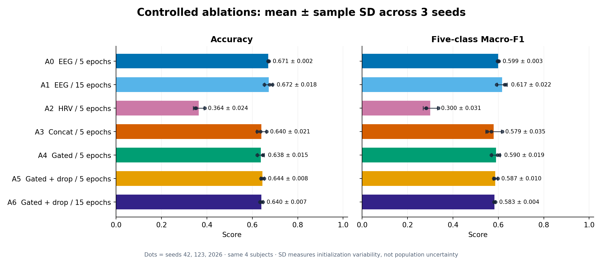

Points are individual seeds; bars/error bars summarize means/sample SD, not ensembles or confidence intervals. / 点为单个种子；条形和误差线为均值／样本标准差，不是集成或人群置信区间。

## 840 training-epoch logs; shaded bands are seed SD / 840 轮训练日志，阴影为种子标准差

[PNG](../results/v2/figures/training_curves.png) · [SVG](../results/v2/figures/training_curves.svg) · [PDF](../results/v2/figures/training_curves.pdf)

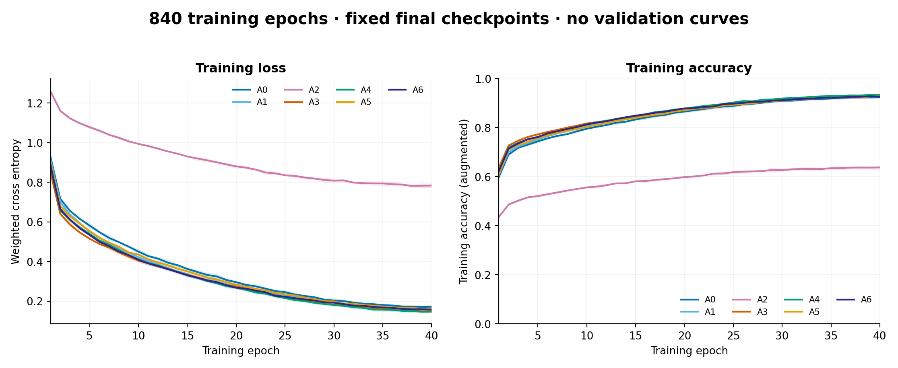

Training loss and training accuracy only; no validation curve or test-guided checkpoint selection. / 只有训练损失和训练准确率；无验证曲线或按测试成绩选择权重。

## MIT and ISRUC results on the same fixed subject split / 同一受试者划分下两个数据库的成绩

[PNG](../results/v2/figures/dataset_results.png) · [SVG](../results/v2/figures/dataset_results.svg) · [PDF](../results/v2/figures/dataset_results.pdf)

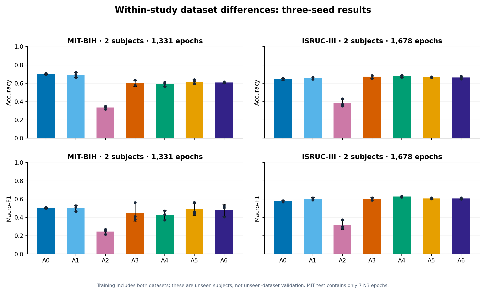

Both sources occur in training; these are source-specific held-out subjects, not external source validation. / 两个库都参与训练；这是各库留出受试者成绩，不是外部跨库验证。

## Five-stage F1 and true class supports / 五类 F1 及真实样本数量

[PNG](../results/v2/figures/per_class_f1.png) · [SVG](../results/v2/figures/per_class_f1.svg) · [PDF](../results/v2/figures/per_class_f1.pdf)

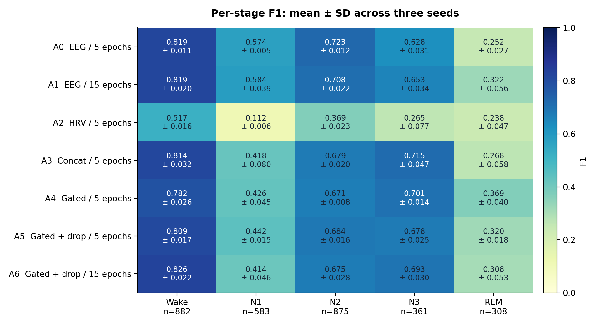

Read F1 alongside support; a change in REM alone does not establish overall improvement. / 结合支持量阅读 F1；仅 REM 改善不等于整体提高。

## All seven equal-probability ensembles; counts and row percentages / 七个概率平均集成的混淆矩阵、计数及行比例

[PNG](../results/v2/figures/confusion_matrices.png) · [SVG](../results/v2/figures/confusion_matrices.svg) · [PDF](../results/v2/figures/confusion_matrices.pdf)

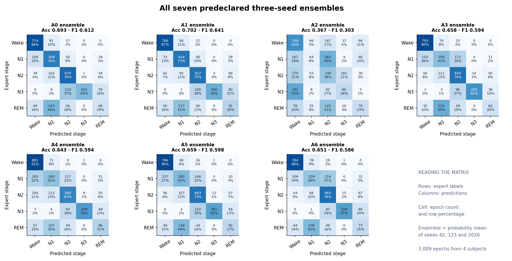

Rows are expert stages, columns predictions; off-diagonal cells show errors. These use probability ensembles. / 行为专家阶段、列为预测；离对角线是错误去向。此图使用概率平均集成。

## Normal inputs versus completely unavailable HRV / 正常输入与 HRV 完全不可用的预设测试

[PNG](../results/v2/figures/missing_hrv_robustness.png) · [SVG](../results/v2/figures/missing_hrv_robustness.svg) · [PDF](../results/v2/figures/missing_hrv_robustness.pdf)

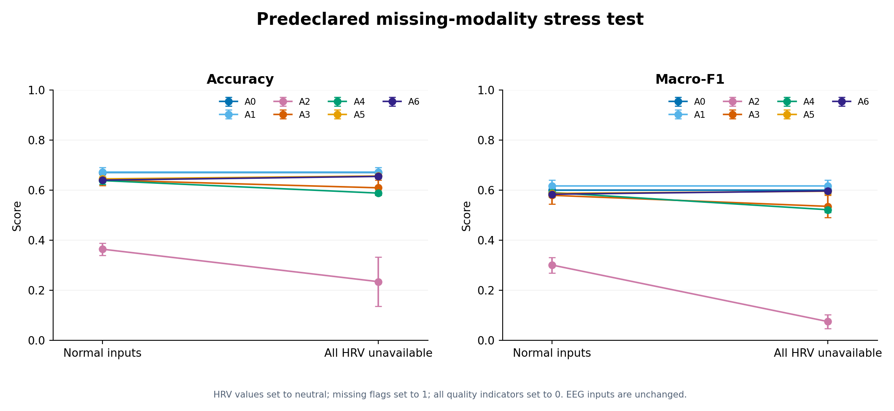

The missing condition removes all HRV; compare the same variant across conditions, then compare dropout variants. / 缺失条件移除全部 HRV；先比较同一模型两种条件，再比较有／无模态丢弃。

## Four subject outcomes with fixed-five-class F1 / 四位受试者的准确率和固定五类 F1

[PNG](../results/v2/figures/subject_results.png) · [SVG](../results/v2/figures/subject_results.svg) · [PDF](../results/v2/figures/subject_results.pdf)

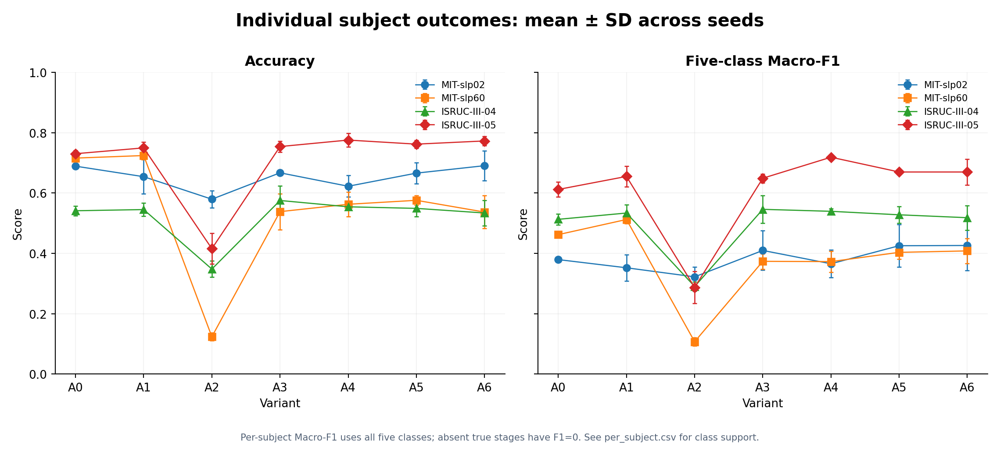

Pooled scores are not an unweighted average of people. Fixed-five-class F1 assigns zero to absent stages. / 窗口汇总不是受试者简单平均；逐人固定五类 F1 对不存在阶段计 0。

## Effective cardiac weights by stage and dataset / 按阶段和数据库展示有效心脏权重

[PNG](../results/v2/figures/gate_analysis.png) · [SVG](../results/v2/figures/gate_analysis.svg) · [PDF](../results/v2/figures/gate_analysis.pdf)

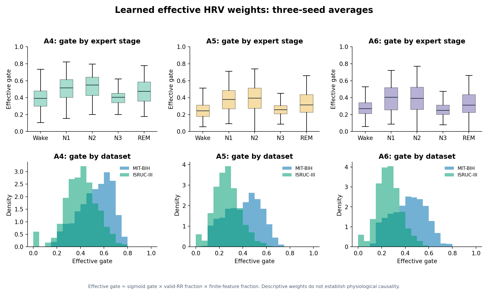

Effective scalar weights describe model behavior, not physiological causality or validated signal quality. / 有效标量权重描述模型行为，不证明生理因果或经过验证的信号质量。

## All held-out recordings: expert, A0 ensemble and A6 ensemble / 全部测试记录的专家标注、A0 与 A6 集成时间图

[PNG](../results/v2/figures/sleep_timelines.png) · [SVG](../results/v2/figures/sleep_timelines.svg) · [PDF](../results/v2/figures/sleep_timelines.pdf)

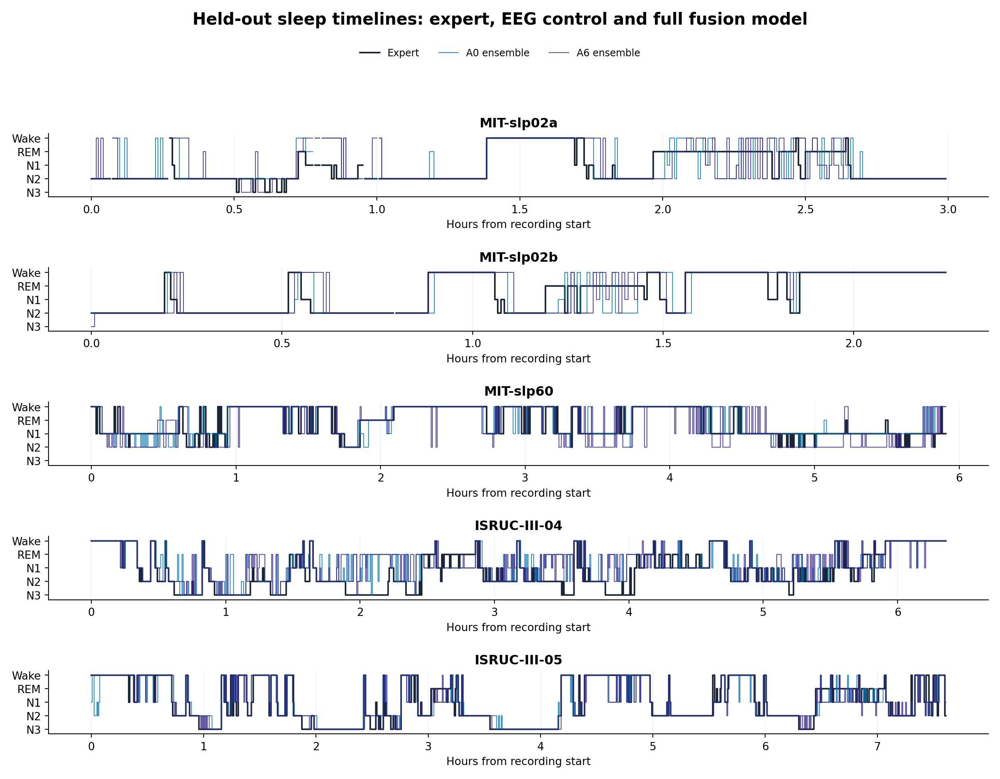

All five test records are shown. Expert labels are references; trace disagreements identify temporal errors. / 展示全部五条测试记录；专家标签是参考，曲线偏离标出错误发生的时间。

## Fixed random training-only ECG segments and detected beats / 固定随机训练 ECG 片段与检测心跳

[PNG](../results/v2/figures/ecg_review.png) · [SVG](../results/v2/figures/ecg_review.svg) · [PDF](../results/v2/figures/ecg_review.pdf)

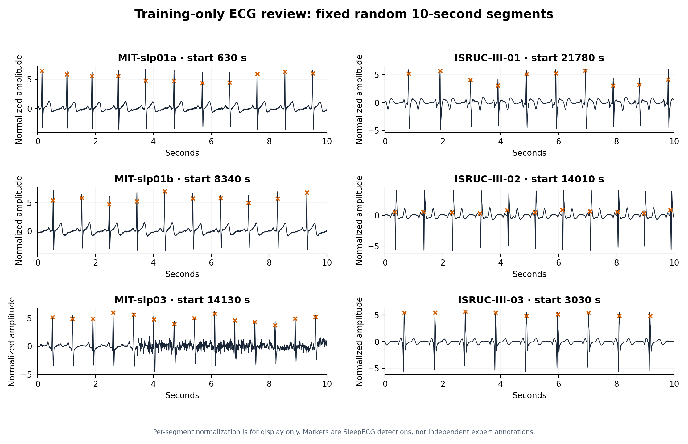

Display-normalized fixed training segments; beat markers are detector outputs, not independent annotations. / 固定训练片段仅作显示标准化；心跳标记是检测输出，不是独立专家标注。

## MIT beat detection against provider annotations; 150 ms tolerance / MIT 心跳检测与官方逐拍标注对比，容差 150 ms

[PNG](../results/v2/figures/ecg_detection.png) · [SVG](../results/v2/figures/ecg_detection.svg) · [PDF](../results/v2/figures/ecg_detection.pdf)

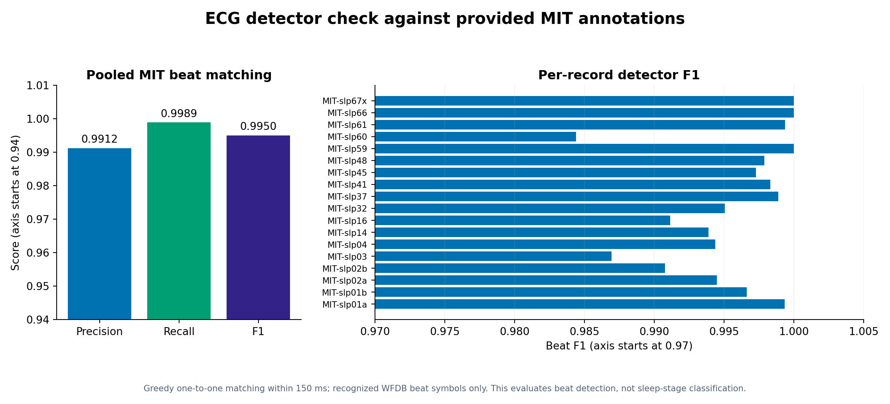

MIT beat matching at 150 ms; truncated axes are labeled. Beat F1 is separate from sleep-stage F1. / MIT 逐拍匹配容差 150 ms，截断坐标已注明；心跳 F1 与睡眠阶段 F1 不同。

# Technical diagrams / 技术说明图

Generated with `python -m experiments.v2.technical_figures`; each topic has English and Chinese PNG/SVG/PDF. Preserved inputs and outputs are used without retraining. / 六个主题均提供中英文三种格式，使用既有输入与预测，不进行新训练。

## Signals to predictions / 信号到预测

Follow EEG, ECG and expert labels to aligned inputs; labels remain targets and scaling is training-only. / 按 EEG、ECG 和专家标签追踪至对齐输入；标签是目标，预处理统计仅由训练集拟合。

**en**: [PNG](figures/data_pipeline.en.png) · [SVG](figures/data_pipeline.en.svg) · [PDF](figures/data_pipeline.en.pdf)

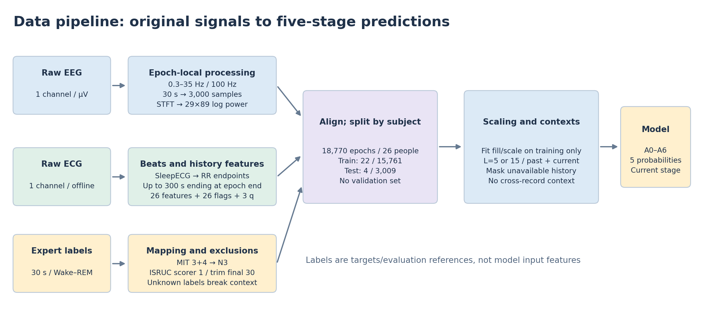

**zh-CN**: [PNG](figures/data_pipeline.zh-CN.png) · [SVG](figures/data_pipeline.zh-CN.svg) · [PDF](figures/data_pipeline.zh-CN.pdf)

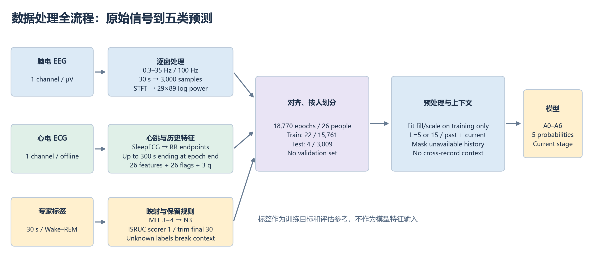

## A1 and A6 layer structure / A1 与 A6 分层结构

Follow the dimensions from one spectrum to one epoch vector, then to the current-stage output. / 从频谱尺寸读到窗口向量，再读到当前阶段输出。

**en**: [PNG](figures/model_architecture.en.png) · [SVG](figures/model_architecture.en.svg) · [PDF](figures/model_architecture.en.pdf)

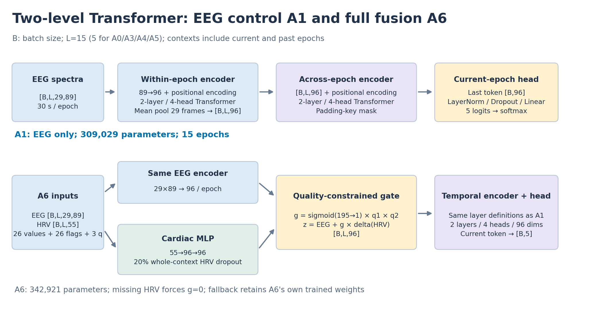

**zh-CN**: [PNG](figures/model_architecture.zh-CN.png) · [SVG](figures/model_architecture.zh-CN.svg) · [PDF](figures/model_architecture.zh-CN.pdf)

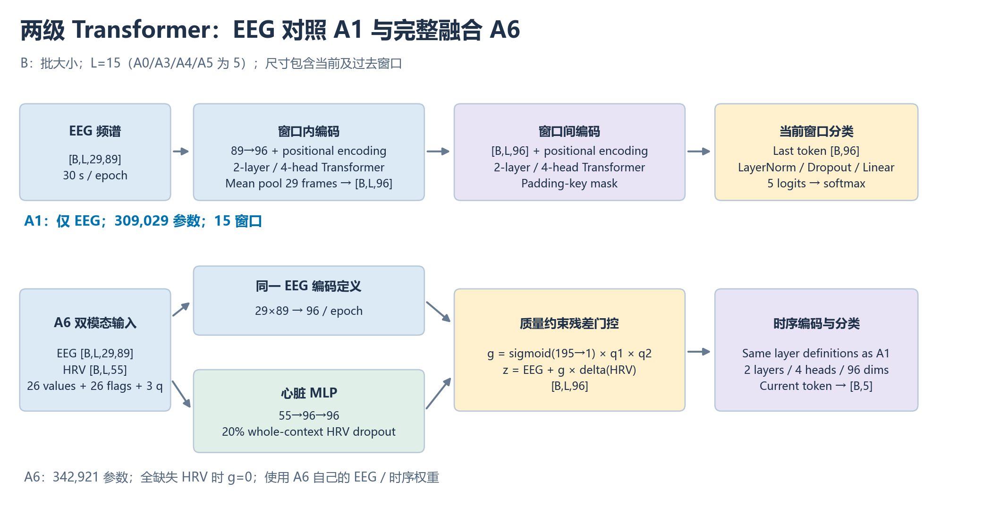

## Residual gate and fallback / 残差门控与回退

The EEG path is retained; q1/q2 bound one cardiac weight per epoch. / 保留 EEG 主路径，q1／q2 约束每窗口一个心脏权重。

**en**: [PNG](figures/gated_fusion.en.png) · [SVG](figures/gated_fusion.en.svg) · [PDF](figures/gated_fusion.en.pdf)

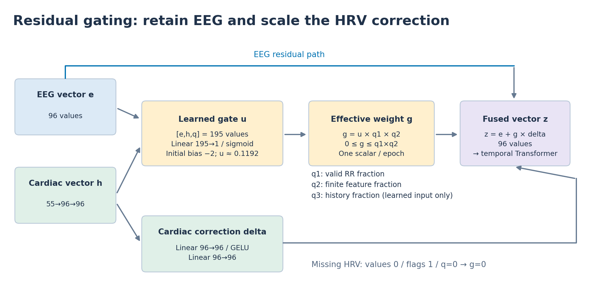

**zh-CN**: [PNG](figures/gated_fusion.zh-CN.png) · [SVG](figures/gated_fusion.zh-CN.svg) · [PDF](figures/gated_fusion.zh-CN.pdf)

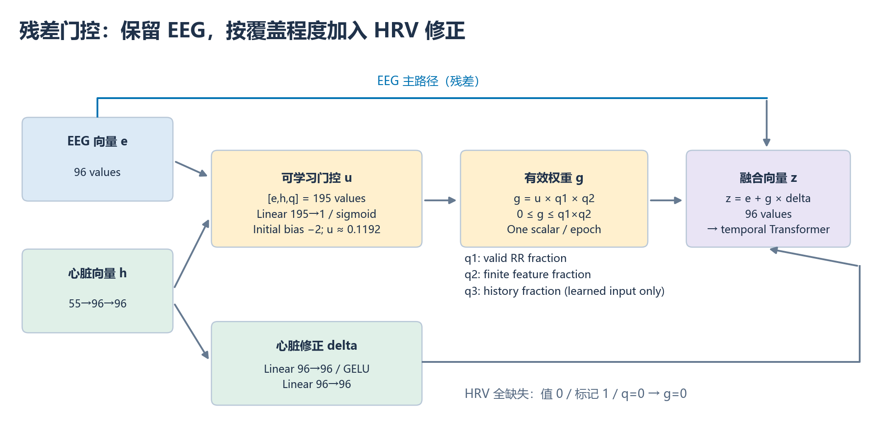

## EEG context and nested HRV histories / EEG 上下文与嵌套 HRV 历史

5/15 EEG epochs cover 2.5/7.5 min; their RR-endpoint histories jointly cover 7/12 min. / 5／15 个 EEG 窗口覆盖 2.5／7.5 分钟，RR 终点历史联合覆盖 7／12 分钟。

**en**: [PNG](figures/time_alignment.en.png) · [SVG](figures/time_alignment.en.svg) · [PDF](figures/time_alignment.en.pdf)

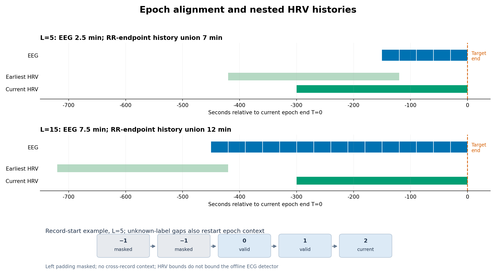

**zh-CN**: [PNG](figures/time_alignment.zh-CN.png) · [SVG](figures/time_alignment.zh-CN.svg) · [PDF](figures/time_alignment.zh-CN.pdf)

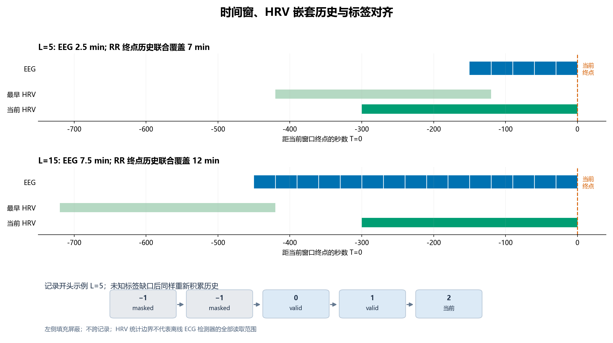

## Actual signal representations / 真实信号表示

EEG/spectrum are one training epoch; ECG/RR are a separate training example with explicit provenance. / EEG／频谱为同一训练窗口；ECG／RR 为另一个注明来源的训练片段。

**en**: [PNG](figures/signal_walkthrough.en.png) · [SVG](figures/signal_walkthrough.en.svg) · [PDF](figures/signal_walkthrough.en.pdf)

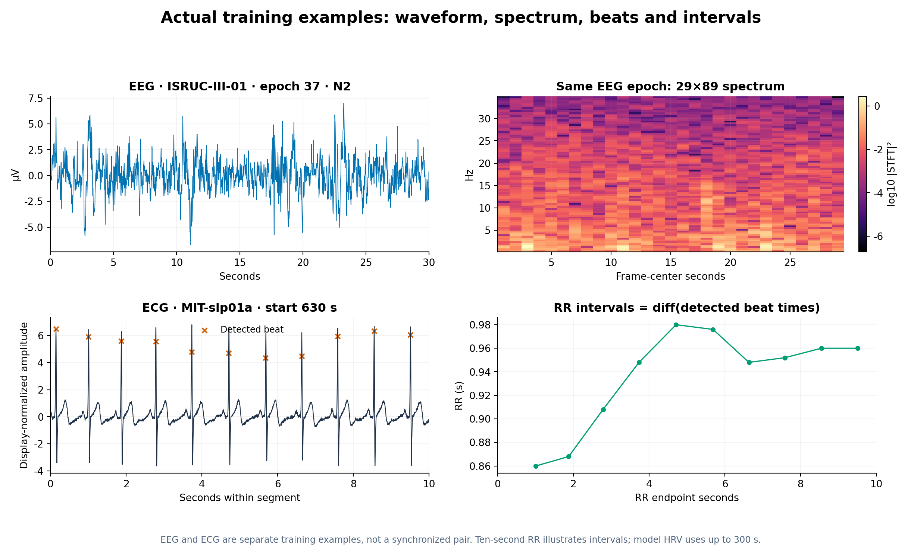

**zh-CN**: [PNG](figures/signal_walkthrough.zh-CN.png) · [SVG](figures/signal_walkthrough.zh-CN.svg) · [PDF](figures/signal_walkthrough.zh-CN.pdf)

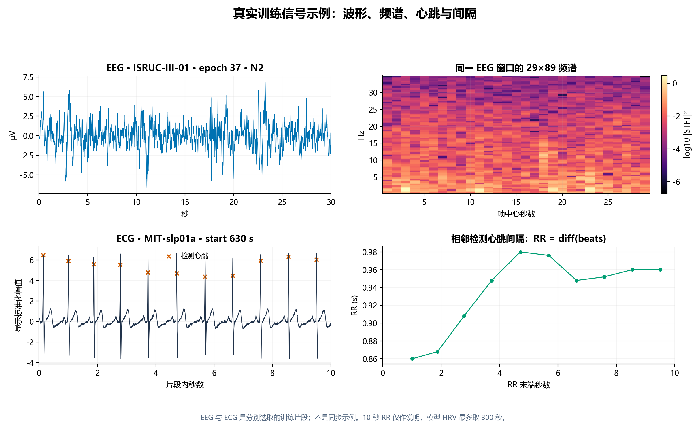

## Fixed probability examples / 固定概率案例

First sorted example per outcome category, not confidence-selected or representative of population frequency. / 每类取排序后的首例，不按置信度选取，也不代表总体频率。

**en**: [PNG](figures/prediction_cases.en.png) · [SVG](figures/prediction_cases.en.svg) · [PDF](figures/prediction_cases.en.pdf)

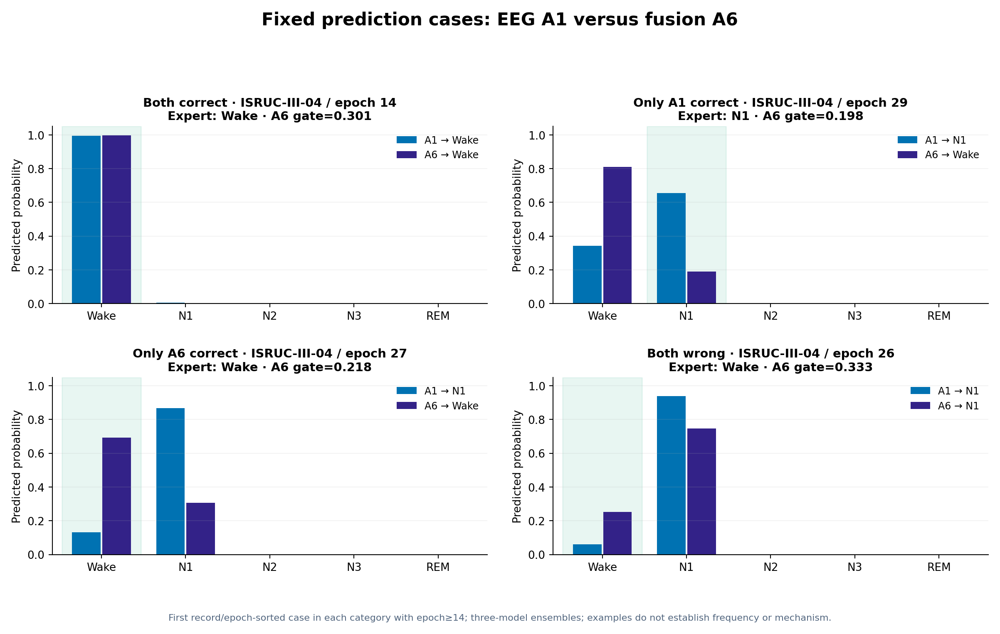

**zh-CN**: [PNG](figures/prediction_cases.zh-CN.png) · [SVG](figures/prediction_cases.zh-CN.svg) · [PDF](figures/prediction_cases.zh-CN.pdf)

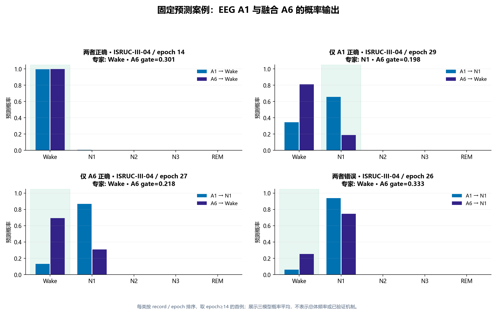

[Signal provenance / 信号示例来源](figures/provenance.json) · [Fixed case data / 固定案例数据](tables/prediction_cases.csv) · [Numeric breakdown / 数值分解](tables/result_breakdown.md)
